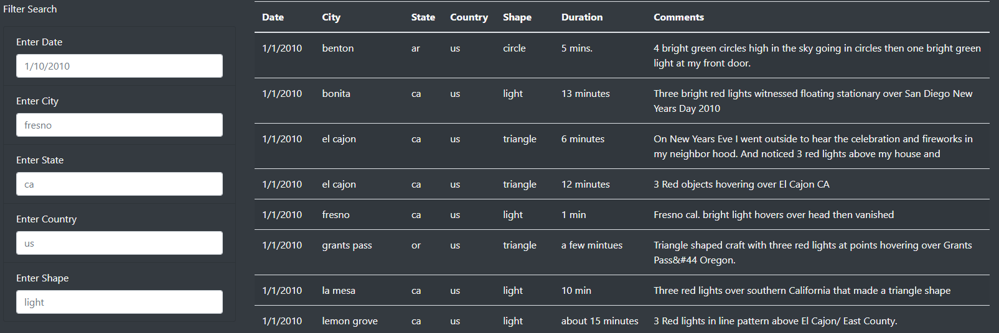
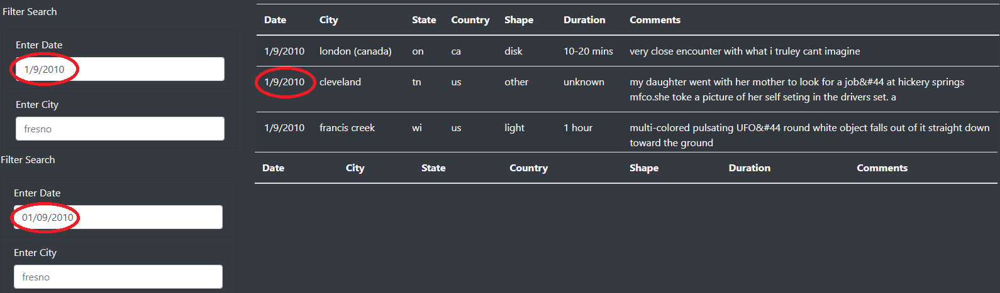
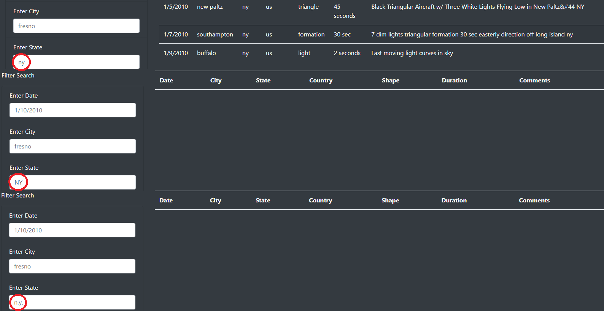
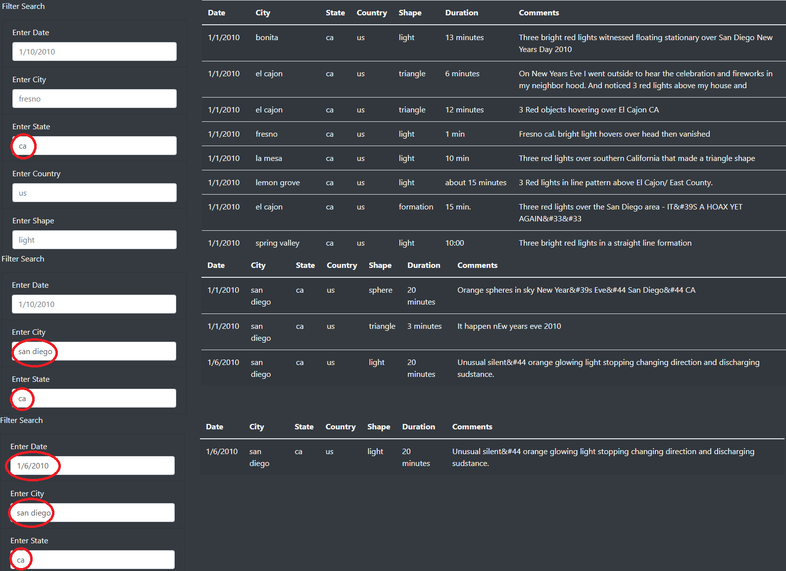

# JavaScript Dynamic Table Challenge
## Overview
After being provided a selection of UFO data, we have been tasked with creating a webpage and dynamic table that will respond to multiple filter options.

With this aspect achieved, I will go over how the webpage and its filters work, as well as some drawbacks and suggestions for refining the project in the future.

## Results

To start with, this is what the filter will look like upon entering the webpage. There is a sampling of the data, as well as the filtering options with placeholders that exist in the data. Additionally, the placeholders double as an example of how each criteria needs to be typed in order to yield results. To return to the default page, all that needs to be done is clear the filters and press enter while they are all blank.

This filter is not flexible in what it allows. The input needs to be exactly as it is in the data. The date must be written in a M/D/YYYY format, and the location information and shape need to be lowercase and without punctuation. This is shown below.

There are fiver filter options to choose from. They can be used together in any combination. As many filters as the user wishes to utilize can be used, one or five or somewhere between, and all will bring a result so long as each combination exists in the data. Some examples have been given below.

There are a couple notes to give about the filter and filtering process. The first is the filter does not "refine" or "retain" results. It goes through the entire data again and filters it anew. That is to say, if you look at all the UFO sightings in California and want to look at each of the shapes individually, it does not matter if "triangle" is put in while "oval" results are being given. As long as it says "ca" and "triangle" you will still get the desired results. The input is the most important thing. 

Another detail to note is that the filtering results will display either by either pressing "enter" or clicking on the page, whether it is another filter option a random location.

## Summary
The biggest drawback of this design is the lack of flexibility in the inputs that will give a result. On top of that, we have nothing to inform the user that this is the case. If they capitalize words out of habit, they might think nothing they put in has results, and will have no reason to think otherwise.

I have several recommendations for the webpage going forward, the first would be to have a box over the filter that informs the visitor of the limitations of the filter and the data, and instructs the visitor on how the input boxes need to filled in order to see results. In addition to this, whenever the filter has nothing to return, I think it needs to inform the visitor of this, so there is no confusion on whether they mistyped something or if there are actually no results.

Another suggestion I have is would be a dropdown menu. Not necessarily for every field, but there is no guide for what is present in the data. As is, the visitor has to guess at what countries, shapes, states, and cities are present in the data. It is impractical, and leaves too much guesswork up to the visitor of the site.
